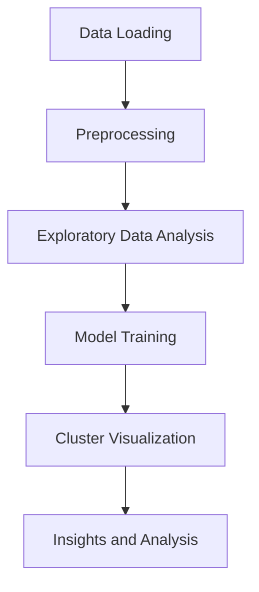

```markdown
---
title: "Comprehensive Documentation for Customer Segmentation Project"
author: "AI Documentation Generator"
date: "`r Sys.Date()`"
output:
  html_document:
    toc: true
    toc_depth: 3
    toc_float: true
---

# Overview

This repository contains a Python-based project for customer segmentation using K-Means clustering. The goal of the project is to segment customers based on their purchasing behavior, enabling businesses to tailor marketing strategies and improve customer engagement. The project utilizes a dataset containing customer information such as age, income, and spending score.

# Architecture

The project is structured into the following components:

1. **Data Loading and Preprocessing**: Load the dataset and preprocess it by handling missing values and scaling features.
2. **Exploratory Data Analysis (EDA)**: Visualize the data to understand distributions and relationships between features.
3. **Model Training**: Apply the K-Means clustering algorithm to segment customers.
4. **Visualization of Clusters**: Plot the clusters to interpret the results visually.
5. **Analysis and Insights**: Analyze the clusters to derive actionable business insights.



# Key Modules

<details>
<summary><b>Data Loading and Preprocessing</b></summary>

```python
import pandas as pd
from sklearn.preprocessing import StandardScaler

# Load the dataset
data = pd.read_csv('Mall_Customers.csv')

# Preprocessing: Selecting relevant columns and scaling
X = data.iloc[:, [3, 4]].values
scaler = StandardScaler()
X_scaled = scaler.fit_transform(X)
```
</details>

<details>
<summary><b>Exploratory Data Analysis (EDA)</b></summary>

```python
import matplotlib.pyplot as plt
import seaborn as sns

# Plot income vs spending score
sns.scatterplot(x=data['Annual Income (k$)'], y=data['Spending Score (1-100)'])
plt.title('Income vs Spending Score')
plt.show()
```
</details>

<details>
<summary><b>Model Training (K-Means Clustering)</b></summary>

```python
from sklearn.cluster import KMeans

# Determine the optimal number of clusters using the Elbow Method
wcss = []
for i in range(1, 11):
    kmeans = KMeans(n_clusters=i, init='k-means++', random_state=42)
    kmeans.fit(X_scaled)
    wcss.append(kmeans.inertia_)

# Plot the Elbow Method graph
plt.plot(range(1, 11), wcss)
plt.title('Elbow Method')
plt.xlabel('Number of Clusters')
plt.ylabel('WCSS')
plt.show()

# Apply K-Means with optimal clusters
kmeans = KMeans(n_clusters=5, init='k-means++', random_state=42)
y_kmeans = kmeans.fit_predict(X_scaled)
```
</details>

<details>
<summary><b>Visualization of Clusters</b></summary>

```python
# Visualize the clusters
plt.scatter(X_scaled[y_kmeans == 0, 0], X_scaled[y_kmeans == 0, 1], s=100, c='red', label='Cluster 1')
plt.scatter(X_scaled[y_kmeans == 1, 0], X_scaled[y_kmeans == 1, 1], s=100, c='blue', label='Cluster 2')
plt.scatter(X_scaled[y_kmeans == 2, 0], X_scaled[y_kmeans == 2, 1], s=100, c='green', label='Cluster 3')
plt.scatter(X_scaled[y_kmeans == 3, 0], X_scaled[y_kmeans == 3, 1], s=100, c='cyan', label='Cluster 4')
plt.scatter(X_scaled[y_kmeans == 4, 0], X_scaled[y_kmeans == 4, 1], s=100, c='magenta', label='Cluster 5')
plt.scatter(kmeans.cluster_centers_[:, 0], kmeans.cluster_centers_[:, 1], s=300, c='yellow', label='Centroids')
plt.title('Customer Segments')
plt.xlabel('Annual Income (scaled)')
plt.ylabel('Spending Score (scaled)')
plt.legend()
plt.show()
```
</details>

# How It Works

1. **Data Preparation**: The dataset is loaded, and relevant features are selected and scaled.
2. **Exploration**: Data is visualized to identify patterns and relationships.
3. **Clustering**: The K-Means algorithm is applied to segment customers into distinct groups.
4. **Visualization**: The resulting clusters are plotted to interpret the segmentation.
5. **Insights**: Each cluster is analyzed to understand customer behavior and derive actionable insights.

> **Note**: The Elbow Method is used to determine the optimal number of clusters for the K-Means algorithm.

# Technologies Used

| **Technology**       | **Description**                                     |
|-----------------------|-----------------------------------------------------|
| Python               | Primary programming language for the project        |
| Pandas               | Data manipulation and analysis                     |
| Scikit-learn         | Machine learning library for K-Means clustering    |
| Matplotlib           | Data visualization library                         |
| Seaborn              | Advanced data visualization library                |
| Jupyter Notebook     | Interactive environment for Python development    |

# Importance and Use Cases

Customer segmentation is crucial for businesses to:
- **Target Marketing**: Tailor marketing strategies to specific customer groups.
- **Improve Engagement**: Enhance customer satisfaction by understanding their needs.
- **Optimize Resources**: Allocate resources effectively based on customer behavior.

This project demonstrates how machine learning can be applied to derive meaningful insights from customer data.

# Conclusion

This project provides a comprehensive approach to customer segmentation using K-Means clustering. By analyzing customer behavior, businesses can make data-driven decisions to improve their marketing strategies and customer engagement. The repository serves as a practical guide for implementing clustering techniques in Python.

```
